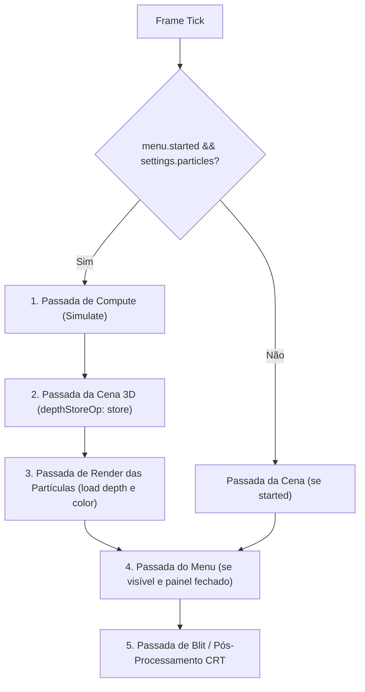

# Efeito Externo nº 2: Simulação de Partículas (Poeira e Brasas)

## Fonte
- **Fonte:** https://github.com/webgpu/webgpu-samples/tree/main/sample/particles
- **Projeto:** WebGPU Samples (webgpu/webgpu-samples)
- **Autores:** WebGPU Samples Contributors (conforme o LICENSE do repositório)
- **Licença:** BSD-3-Clause
- **Acessado em:** 03/10/2026
- **Arquivos originais:** particle.wgsl, probabilityMap.wgsl, main.ts.txt (referência), LICENSE-webgpu-samples.txt
- Os arquivos originais na pasta `src/shaders/external/particles/` permanecem sem modificações.

---

## Análise

A análise a seguir baseia-se estritamente na leitura dos arquivos originais `particle.wgsl` e `main.ts.txt` fornecidos pelo exemplo "Particles" do repositório `webgpu-samples`:

### 1. Estrutura da Partícula (`struct Particle`)
No arquivo `particle.wgsl` original, a struct da partícula é definida como:
```wgsl
struct Particle {
  position : vec3f,
  lifetime : f32,
  color    : vec4f,
  velocity : vec3f,
}
```
No `main.ts.txt`, o tamanho por instância (`particleInstanceByteSize`) é calculado como:
- `position`: $3 \times 4$ bytes (12 bytes)
- `lifetime`: $1 \times 4$ bytes (4 bytes)
- `color`: $4 \times 4$ bytes (16 bytes)
- `velocity`: $3 \times 4$ bytes (12 bytes)
- `padding`: $1 \times 4$ bytes (4 bytes)
Totalizando 48 bytes por partícula no buffer instanciado.

### 2. Gerador de Números Pseudoaleatórios
O código em `particle.wgsl` implementa um PRNG rápido baseado em operações bitwise inteiras sobre um vetor `var<private> rnd : vec4u`:
- `init_rand(invocation_id: u32, seed: vec4u)`: Inicializa o vetor interno `rnd` multiplicando o identificador da invocação por um vetor de constantes primas `A = vec4(1741651 * 1009, 140893 * 1609 * 13, 6521 * 983 * 7 * 2, 1109 * 509 * 83 * 11 * 3)` e aplicando XOR com uma semente de 128 bits fornecida pela CPU a cada quadro.
- `rand() -> f32`: Atualiza `rnd` com o produto por outra constante `C = vec4(60493 * 9377, 11279 * 2539 * 23, 7919 * 631 * 5 * 3, 1277 * 211 * 19 * 7 * 2)` combinado com rotação de componentes (`rnd.yzwx >> 4u`), retornando `f32(rnd.x ^ rnd.y) / f32(0xffffffff)`, resultando em um float pseudoaleatório uniforme no intervalo $[0.0, 1.0]$. A distribuição e qualidade estatística são suficientes para dispersão visual em tempo real.

### 3. Função de Simulação (`simulate`)
- Decorada com `@compute @workgroup_size(64)`.
- Executada com uma invocação por partícula (`global_invocation_id.x`).
- **Envelhecimento:** A cada passo, subtrai `deltaTime` de `lifetime` e calcula a transparência da cor por `color.a = smoothstep(0.0, 0.5, lifetime)`.
- **Física:** Aplica gravidade ao eixo Z (`velocity.z -= deltaTime * 0.5`) e integração básica de velocidade linear (`position += deltaTime * velocity`).
- **Renascimento:** Quando `lifetime < 0.0`, a partícula renasce consultando uma textura de mapa de probabilidades (`probabilityMap.wgsl` / mip levels de uma imagem) para selecionar a coordenada de emissão em 2D, define velocidade aleatória (`vx, vy` em $[-0.05, 0.05]$ e `vz` em $[0.0, 0.3]$) e reseta `lifetime = 0.5 + rand() * 3.0`.
- Grava a partícula resultante de volta no array de armazenamento `data.particles[idx]`.

### 4. Shaders de Vértice e Fragmento
- **Vértice (`vs_main`):** Recebe os atributos de instância (`position`, `color`) e do quad local (`quad_pos: vec2f`). Constrói uma matriz `mat2x3f(render_params.right, render_params.up)` multiplicada por `quad_pos`, desloca o vértice por `quad_pos * 0.01` e projeta via `render_params.modelViewProjectionMatrix`.
- **Fragmento (`fs_main`):** Recebe a cor interpolada e aplica máscara circular na transparência: `color.a = color.a * max(1.0 - length(in.quad_pos), 0.0)`.

### 5. Uniforms e Recursos no `main.ts.txt`
- `RenderParams`: Matriz MVP ($4 \times 4 \times 4$ bytes), vetor `right: vec3f` com 4 bytes de padding e vetor `up: vec3f` com 4 bytes de padding (total de 96 bytes).
- `SimulationParams`: `deltaTime` (4 bytes), `brightnessFactor` (4 bytes), padding (8 bytes) e `seed: vec4u` (16 bytes), totalizando 32 bytes.
- **Pipelines e Buffers:**
  - `particlesBuffer`: Criado com `size: numParticles * particleInstanceByteSize` e usage `GPUBufferUsage.VERTEX | GPUBufferUsage.STORAGE`.
  - `quadVertexBuffer`: Buffer de vértice estático com 6 vértices `vec2f` compondo 2 triângulos (coordenadas $[-1, -1]$ a $[+1, +1]$).
  - `renderPipeline`: Pipeline gráfica com topologia `triangle-list`, mesclagem aditiva (`srcFactor: 'src-alpha'`, `dstFactor: 'one'`), teste de profundidade com `depthWriteEnabled: false` e formato `presentationFormat: 'rgba16float'`.
  - `computePipeline`: Pipeline computacional criada a partir de `particleWGSL` com ponto de entrada `simulate`.
  - Geração de mapa de probabilidade: Faz download de `webgpu.png`, calcula mipmaps e executa passadas de computação prévias para gerar a distribuição espacial de nascimento.

---

## Adaptações

A tabela abaixo resume as adaptações realizadas no código original para atender aos requisitos visuais e arquiteturais do Doom no navegador:

| Elemento do Original | O que mudou | Motivo da adaptação |
| :--- | :--- | :--- |
| **Mapa de Probabilidade (`probabilityMap.wgsl` e textura)** | Removido integralmente. O nascimento e renascimento ocorrem por coordenadas uniformemente distribuídas dentro de uma caixa tridimensional centrada na câmera. | No Doom as partículas são poeira e brasas ambientais no espaço 3D do jogador, dispensando texturas de densidade ou imagens de spawn. |
| **Estrutura da Partícula (`Particle`)** | Reestruturada para 48 bytes sem cor explícita: `position: vec3<f32>` (offset 0), `life: f32` (offset 12), `velocity: vec3<f32>` (offset 16), `kind: f32` (offset 28), `params: vec4<f32>` (offset 32). | Alinhamento natural de 16 bytes em WGSL; a cor passa a ser indexada na paleta do Doom via textura `litPalette` (256x32). |
| **Sistema de Eixos e Gravidade** | Eixo Y é para cima (convenção do mundo 3D do projeto). Remoção da gravidade para baixo; brasas sobem ativamente por velocidade própria positiva em Y e poeira flutua com baixa velocidade vertical. | Adequação ao espaço de mundo do renderizador e à física de brasas incandescentes e partículas de poeira. |
| **Envolvimento de Fronteira (Wrap)** | Implementação de toroide tridimensional relativo à câmera: $d = \text{pos} - \text{cam}$; $d = ((d + h) - 2h \cdot \text{floor}((d + h) / (2h))) - h$; $\text{pos} = \text{cam} + d$. | Mantém a nuvem de partículas acompanhando o jogador continuamente sem acúmulo em bordas, sem salto visual ao voar ou reiniciar o mapa e sem usar o operador `%` (que trunca em direção a zero). |
| **Aparência e Fragmento** | Remoção de blending e do recorte circular `length(quad_pos)`. Fragmento escreve opaco (alfa 1.0) com cores discretas da paleta. | Fidelidade estética ao estilo visual do Doom: partículas são pixels sólidos com bordas duras. |
| **Modelo de Tamanho em Pixels (Screen-Aligned Quad)** | Substituição do tamanho arbitrário no mundo por cálculo em pixels da textura interna: $upp = w \cdot 2 \cdot \tan(\text{fovY}/2) / H$; $basePx = size \cdot sizeScale / upp$; $sizePx = \text{clamp}(\text{round}(basePx), minPixels, maxPixels)$. Quads alinhados à tela sem vetores `right`/`up` da câmera, com `pixelSnap` opcional. Descarte se $w < 1.0$ ou centro $> sizePx$ fora da tela. | Garante que as partículas tenham tamanhos exatos em pixels nativos da resolução interna, cresçam de forma contínua até `maxPixels` e diminuam até `minPixels`, sem tremer a grade. |
| **Fade de Vida** | Fator de fade aplicado diretamente ao tamanho em pixels: $fade = \text{clamp}(\min(age, life) / (fadeFraction \cdot lifeTotal), 0, 1)$, com $sizePx = \text{round}(sizePx \cdot fade)$. Se $sizePx < 1$, o vértice é colapsado. | Partículas surgem e desaparecem encolhendo suavemente sem necessitar de blending ou ordenação por profundidade. |
| **Cores e Iluminação** | Cores obtidas por consulta à paleta do WAD (`litPalette[nível][índice]`). Poeira usa a fórmula de setor/distância de flats com `lightnum` configurável; brasas usam nível 0 e alternam quente/frio com frequência `flickerHz`. Com iluminação desligada, nível é 0. | Total fidelidade à iluminação por setores e à paleta PLAYPAL/COLORMAP do Freedoom. |
| **Profundidade (Z-Buffer)** | Render pass usa `depthLoadOp: 'load'`, `depthStoreOp: 'store'`, `depthWriteEnabled: true` e `depthCompare: 'less'`. | As partículas respeitam a oclusão geométrica de paredes, pisos e tetos desenhados pela cena 3D. |
| **Calibragem e Persistência** | Remoção de valores visuais fixos no código; parâmetros configuráveis via painel HTML com tecla `KeyT` ou menu, salvamento em JSON e `localStorage`. | Permite ajuste dinâmico, calibração visual em tempo real e persistência das preferências do usuário. |

---

## Integração

A simulação e o desenho das partículas são integrados ao ciclo de renderização principal (`main.js`) entre a cena 3D e o pós-processamento, respeitando as seguintes fases:



### 1. Passada de Computação (`simulate`)
- **Pipeline:** `GPUComputePipeline` com módulo `src/shaders/particles.wgsl` (`entryPoint: 'simulate'`).
- **Despacho:** `dispatchWorkgroups(Math.ceil(activeCount / 64))`.
- **Condição:** Apenas se `started === true` e `settings.particles === true`. Se o menu estiver visível com `started === true`, o compute roda com `deltaTime = 0.0`. Quando o painel de calibragem está aberto, o compute roda com `deltaTime` normal.
- **Uniform Buffer (`SimulationParams`, 112 bytes):**
  - `cameraPos: vec4<f32>` (offset 0): Posição da câmera no mundo.
  - `seed: vec4<u32>` (offset 16): Semente de números aleatórios de 128 bits atualizada a cada frame.
  - `timeParams: vec4<f32>` (offset 32): `deltaTime`, `time`, `boxHalfXZ`, `boxHalfY`.
  - `spawnParams1: vec4<f32>` (offset 48): `activeCount`, `emberRatio`, `dustSpeed`, `dustSize`.
  - `dustLife: vec4<f32>` (offset 64): `dustLifeMin`, `dustLifeMax`, padding.
  - `emberMotion: vec4<f32>` (offset 80): `emberRiseMin`, `emberRiseMax`, `emberDrift`, `emberSize`.
  - `emberLife: vec4<f32>` (offset 96): `emberLifeMin`, `emberLifeMax`, padding.

### 2. Passada da Cena 3D
- Executada com paredes e flats. Mantém `depthStencilAttachment.depthStoreOp` definido como `'store'`.

### 3. Passada de Desenho das Partículas
- **Pipeline:** `GPURenderPipeline` com topologia `triangle-list`.
- **Attachments:**
  - `colorAttachments[0]`: Visão da textura interna (`sceneColorView`), `loadOp: 'load'`, `storeOp: 'store'`.
  - `depthStencilAttachment`: Visão da profundidade (`sceneDepthView`), `depthLoadOp: 'load'`, `depthStoreOp: 'store'`, `depthWriteEnabled: true`, `depthCompare: 'less'`.
- **Chamada de Desenho:** `passEncoder.draw(6, activeCount, 0, 0)`.
- **Uniform Buffer (`DrawParams`, 144 bytes):**
  - `viewProj: mat4x4<f32>` (offset 0, 64 bytes): Matriz de visualização-projeção combinada.
  - `cameraPos: vec4<f32>` (offset 64, 16 bytes): Posição da câmera no mundo.
  - `screenParams: vec4<f32>` (offset 80, 16 bytes): `internalWidth`, `internalHeight`, `tanHalfFov`, `time`.
  - `renderParams: vec4<f32>` (offset 96, 16 bytes): `sizeScale`, `minPixels`, `maxPixels`, `fadeFraction`.
  - `paletteIndices: vec4<u32>` (offset 112, 16 bytes): `dustIdx`, `warmEmberIdx`, `coldEmberIdx`, `lightingEnabled`.
  - `configFlags: vec4<f32>` (offset 128, 16 bytes): `pixelSnap`, `flickerHz`, `dustLightnum`, `disableFade`.
- **Recurso de Textura:** `litPalette` (textura 2D `rgba8unorm` $256 \times 32$) no binding 1 do grupo de renderização.

---

## Parâmetros

Os parâmetros do sistema são organizados em seções e definidos em `config/particles.json`:

```json
{
  "version": 1,
  "count": 1200,
  "emberRatio": 0.25,
  "boxHalfXZ": 512,
  "boxHalfY": 128,
  "dust": {
    "size": 0.35,
    "lifeMin": 6,
    "lifeMax": 12,
    "speed": 6,
    "color": "#C0B8A8",
    "lightnum": 7
  },
  "ember": {
    "size": 0.6,
    "lifeMin": 1.5,
    "lifeMax": 3.5,
    "riseMin": 24,
    "riseMax": 48,
    "drift": 8,
    "colorHot": "#FFA030",
    "colorCool": "#C84010",
    "flickerHz": 8
  },
  "render": {
    "sizeScale": 1.0,
    "minPixels": 1,
    "maxPixels": 6,
    "pixelSnap": true,
    "fadeFraction": 0.15
  }
}
```

### Tabela de Faixas Válidas e Padrões

| Campo | Faixa Válida | Tipo | Padrão | Aplicação |
| :--- | :--- | :--- | :--- | :--- |
| `version` | 1 | Inteiro | 1 | Versões !== 1 revertem para padrão |
| `count` | 0 a 8192 | Inteiro | 1200 | Imediata (GPU ativo) |
| `emberRatio` | 0.0 a 1.0 | Float | 0.25 | Novos nascimentos |
| `boxHalfXZ` | 128 a 1500 | Float | 512 | Imediata (wrap toroidal) |
| `boxHalfY` | 32 a 400 | Float | 128 | Imediata (wrap toroidal) |
| `dust.size` | 0.05 a 4.0 | Float | 0.35 | Novos nascimentos |
| `dust.lifeMin` | 0.2 a 60.0 | Float | 6.0 | Novos nascimentos |
| `dust.lifeMax` | `dust.lifeMin` a 60.0 | Float | 12.0 | Novos nascimentos |
| `dust.speed` | 0 a 40 | Float | 6.0 | Novos nascimentos |
| `dust.lightnum` | 0 a 15 | Inteiro | 7 | Imediata (sombreamento) |
| `dust.color` | `#RRGGBB` | Hex | `#C0B8A8` | Imediata (mapeamento de paleta) |
| `ember.size` | 0.05 a 4.0 | Float | 0.6 | Novos nascimentos |
| `ember.lifeMin` | 0.2 a 60.0 | Float | 1.5 | Novos nascimentos |
| `ember.lifeMax` | `ember.lifeMin` a 60.0 | Float | 3.5 | Novos nascimentos |
| `ember.riseMin` | 0 a 120 | Float | 24.0 | Novos nascimentos |
| `ember.riseMax` | `ember.riseMin` a 120 | Float | 48.0 | Novos nascimentos |
| `ember.drift` | 0 a 40 | Float | 8.0 | Novos nascimentos |
| `ember.colorHot` | `#RRGGBB` | Hex | `#FFA030` | Imediata (mapeamento de paleta) |
| `ember.colorCool` | `#RRGGBB` | Hex | `#C84010` | Imediata (mapeamento de paleta) |
| `ember.flickerHz` | 0.5 a 30.0 | Float | 8.0 | Imediata (frequência) |
| `render.sizeScale` | 0.25 a 4.0 | Float | 1.0 | Imediata (escala em pixels) |
| `render.minPixels` | 1 a 4 | Inteiro | 1 | Imediata (tamanho mínimo) |
| `render.maxPixels` | `render.minPixels` a 16 | Inteiro | 6 | Imediata (tamanho máximo) |
| `render.pixelSnap` | `true` ou `false` | Booleano | `true` | Imediata (alinhamento de grade) |
| `render.fadeFraction` | 0.0 a 0.5 | Float | 0.15 | Imediata (encolhimento nas pontas) |

---

## Calibragem

O painel HTML de calibragem permite inspecionar e ajustar interativamente todos os parâmetros visuais:
- **Abertura e Fechamento:** Acionado pela tecla `KeyT` (ação `tuning`) ou pelo item `PARTICLE TUNING` no menu de opções. Funciona apenas com o jogo iniciado (`started = true`). Também pode ser fechado por `Esc` ou pelo botão `FECHAR [ESC]`.
- **Comportamento em Modo de Calibragem:**
  - O cursor do mouse é destravado (`document.exitPointerLock`).
  - O menu principal do motor não é renderizado por cima da cena enquanto o painel estiver aberto.
  - A simulação continua executando com `deltaTime` normal.
  - Movimentação do jogador permanece ativa via teclas `W`, `A`, `S`, `D`, `Espaço`, `C` e `R`.
  - A rotação de câmera pelo mouse é desabilitada; em seu lugar, as teclas de setas (`ArrowLeft`, `ArrowRight`, `ArrowUp`, `ArrowDown`) rotacionam a câmera a uma velocidade constante de 90 graus por segundo, com limite de elevação de $\pm 89^\circ$.
  - Ao interagir com sliders, os eventos `pointerup` e `change` removem o foco do elemento (`blur()`) para evitar captura acidental das setas de rotação da câmera.
  - Ao fechar o painel, o bloqueio do cursor (`requestPointerLock`) é solicitado dentro do evento de clique/tecla. Se recusado pelo navegador, o menu convencional do motor é exibido.
- **Ferramentas de Diagnóstico:**
  - *Congelar partículas:* Define $dt = 0$ na simulação, mantendo todas as posições estáticas para inspeção de perto.
  - *Desligar fade:* Força o fator de fade para 1.0, permitindo caminhar em direção a uma partícula parada e observar seu crescimento contínuo de `minPixels` até `maxPixels`.
  - *Tabela de Tamanhos:* Exibe em tempo real o diâmetro calculado em pixels para poeira e brasa nas profundidades fixas de visualização ($z = 16, 32, 64, 128, 256, 512$), utilizando a função pura `pixelSizeAt`.
  - *Reiniciar partículas:* Recalcula a distribuição de posições e vidas escalonadas de todas as 8192 instâncias em torno da câmera atual.
- **Gerenciamento de Arquivo:**
  - *Salvar no arquivo...:* Utiliza a File System Access API (`showSaveFilePicker`) sugerindo `particles.json`, mantendo o handle na sessão para gravações subsequentes. Possui fallback automático para download via Blob.
  - *Copiar JSON:* Copia a representação serializada atual para a área de transferência (`navigator.clipboard.writeText`).
  - *Importar JSON...:* Abre seletor de arquivos locais para carregar configurações em JSON.
  - *Restaurar do arquivo:* Remove a chave de persistência do `localStorage` e recarrega os dados de `config/particles.json`.
  - *Padrões do código:* Restaura imediatamente os valores imutáveis originais de código.

---

## Persistência

O carregamento e persistência dos parâmetros seguem uma hierarquia estrita de prioridades:

1. **Padrões de Código (`DEFAULT_PARTICLE_PARAMS`):** Objeto imutável contendo os valores padrão de fallback definidos em `src/particles/particleConfig.js`.
2. **Arquivo de Configuração (`config/particles.json`):** Carregado na inicialização via `fetch('./config/particles.json')`. Caso o arquivo não seja encontrado ou contenha erros, o sistema emite aviso no console e preserva os padrões de código.
3. **Armazenamento Local (`localStorage`):** Chave `doomgpu.particles.v1`. Possui a mais alta prioridade de carregamento. Cada alteração realizada nos parâmetros no painel ou por código agenda uma gravação assíncrona debounced de 300 ms. Todas as leituras e gravações são protegidas por blocos `try/catch`. Caso o JSON armazenado esteja corrompido, a chave é limpa automaticamente.
