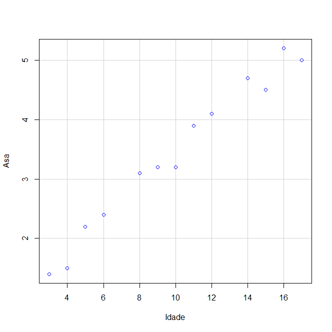
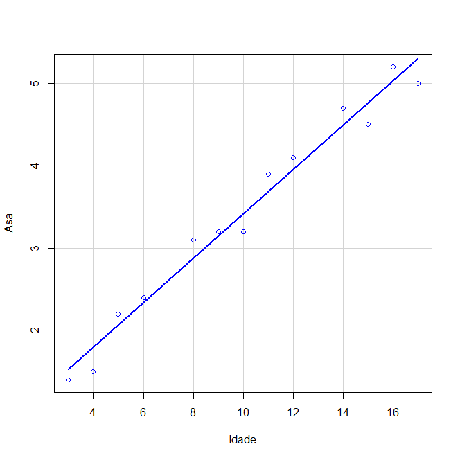

# A



# B

```
            Asa     Idade
Asa   1.0000000 0.9876213
Idade 0.9876213 1.0000000
```

# C



$$b = 0.268$$
$$a = 0.740$$

# D

$$1.072cm$$

# E

$$X=7;\bar{y}=2.616$$

$$X=14;\bar{y}=4.492$$