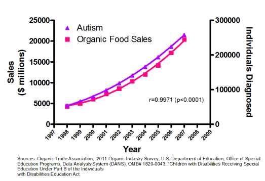

# Analise e estatistica

- [Introdução](#introdução)
  - [O que é uma variável](#o-que-é-uma-variável)
  - [Medidas de posição](#medidas-de-posição)
  - [Medidas de dispersão](#medidas-de-dispersão)
  - [O que é o R](#o-que-é-o-r)
  - [Leitura resumo numérico](#leitura-resumo-numérico)
- [Correlação e regressão](#correlação-e-regressão)
    - [Correlação](#correlação)
    - [Regressão](#regressão)

## Introdução

### O que é uma variável

Uma variável é qualquer caracteristica associada a uma população ou amostra que pode ser medida ou contada. Existem duas grandes classificações para as variáveis, as variáveis qualitativas e as variáveis quantitativas:

- As `variáveis qualitativas`, ou os `fatores` são aquelas que representam uma qualidade, ou seja, uma caracteristica que não pode ser medida, como por exemplo, a cor dos olhos, o sexo, a raça, a religião, etc. Pode ser classificada em nominal e ordinal, sendo que a nominal não possui uma ordem e a ordinal possui uma ordem. 

- As `variáveis quantitativas` são aquelas que representam uma quantidade, ou seja, uma caracteristica que pode ser medida, como por exemplo, a altura, o peso, a idade, etc. Pode ser classificada em discreta e contínua, sendo que a discreta possui valores inteiros e a contínua possui valores reais.

---

### Medidas de posição

As `medidas de posição` são aquelas que representam a posição de um valor em relação aos demais valores de um conjunto de dados. Como exemplo de medidas de posição temos a média, a mediana e a moda.

- A `média` é a soma de todos os valores dividido pela quantidade de valores. É a medida de posição mais comum e é muito sensível a valores extremos.

$$\bar{x} = \frac{\sum_{i=1}^{n} x_i}{n}$$

- A `mediana` é o valor que divide o conjunto de dados em duas partes iguais. Para encontrar a mediana, é necessário ordenar os valores e encontrar o valor do meio. Se a quantidade de valores for par, a mediana é a média dos dois valores do meio.

- A `moda` é o valor que mais se repete no conjunto de dados. Um conjunto de dados pode ter uma moda, mais de uma moda ou não ter moda.

- `Percentis` são medidas de posição que dividem um conjunto de dados em 100 partes iguais. O percentil 50 é a mediana, o percentil 25 é o primeiro quartil e o percentil 75 é o terceiro quartil.

$$ p_i = \frac{i}{100} \times (n+1) $$

---

### Medidas de dispersão

As `medidas de dispersão` são aquelas que representam a dispersão dos valores em relação a média. Como exemplo de medidas de dispersão temos o desvio padrão, a variância, o coeficiente de variação, a amplitude e etc.

- A `variância` é a média dos quadrados dos desvios em relação a média.

$$s^2 = \frac{\sum_{i=1}^{n} (x_i - \bar{x})^2}{n-1}$$

- O `desvio padrão` é a raiz quadrada da variância. Ele é a medida de dispersão mais comum.

$$s = \sqrt{s^2}$$

- O `coeficiente de variação` é o desvio padrão dividido pela média. Ele é uma medida de dispersão relativa e é muito útil para comparar a dispersão de conjuntos de dados diferentes.

$$CV = \frac{s}{\bar{x}} \times 100$$

- A `amplitude` é a diferença entre o maior e o menor valor do conjunto de dados.

---

### O que é o R

O R é uma linguagem de programação e ambiente de desenvolvimento para `computação estatística e gráficos`. Ele é um software livre e de código aberto e é muito utilizado por estatísticos, cientistas de dados e pesquisadores em geral.

Nesse semestre, será utilizado  R Comander, que é uma interface gráfica para o R. Ele é muito útil para quem está começando a aprender R, pois possui uma interface gráfica intuitiva e fácil de usar.

A vantagem de utilizar o R ao invés do Excel é que o R é `mais poderoso` e `flexível`, além de ser `mais eficiente` para lidar com grandes conjuntos de dados. Além disso, o R é gratuito e possui uma comunidade muito ativa, o que facilita a obtenção de ajuda e suporte.

A instalação e a usabilidade dessas ferramentas podem ser encontradas em [Aula2/Documentos](Aula2/Documentos/)

---

### Leitura resumo numérico

Ao realizar um resumo numério com o RComander, é possível obter algumas informações, a forma como você deve interpretar essas informações é:

- `Mean`: é a média dos valores do conjunto de dados da variável selecionada

- `sd`: é o desvio padrão dos valores do conjunto de dados da variável selecionada

- `IQR`: é a amplitude interquartil dos valores do conjunto de dados da variável selecionada

- As porcentagens são os percentis do conjunto de dados da variável selecionada, e o valor maximo que se enquadra em cada percentil

#### Exemplo:

Vamos usar a tabela [CEA2015P01-QV-Demograficos.xlsx](Aula2/Documentos/CEA2015P01-QV-Demograficos.xlsx) para tirar essas conclusões.

Essa tabela é um levantamento de algumas informações de pacientes com cancer de mama, como idade, peso, altura, habitos e etc. 

Fazendo um resumo numérico relacionando o habito de fumar com a idade, temos o seguinte resultado:

|                | mean     | sd       | IQR | 0% | 25% | 50% | 75%  | 100% | Idade:n |
|----------------|----------|----------|-----|----|-----|-----|------|------|---------|
| **Não fumante**    | 48.42105 | 12.230725| 15.0| 24 | 42  | 50  | 57.0 | 69   | 19      |
| **Fumante**        | 52.36364 | 8.405626 | 6.5 | 45 | 47  | 49  | 53.5 | 68   | 11      |

É contra intuitivo a média de idade dos pacientes de cancer fumantes ser mais alta que a dos não fumantes, porém observando de forma mais aprofundada, percebe-se que até o terceiro quartil, a idade dos não fumantes é maior que a dos fumantes. 

Isso demonstra que é sempre importante analisar todos os dados e não se basear apenas na média, que pode ser vista como uma forma mais simples de interpretar os dados.

---

## Correlação e regressão

Correlação e regressão são duas técnicas estatísticas que são utilizadas para analisar a relação entre duas variáveis. A correlação mede a força e a direção da relação entre duas variáveis, enquanto a regressão é utilizada para prever o valor de uma variável a partir do valor de outra variável.

### Correlação

A `correlação` é uma medida estatística que mede a relação entre duas variáveis. Ela varia de -1 a 1, sendo que 1 indica uma relação positiva perfeita, -1 indica uma relação negativa perfeita e 0 indica que não há relação entre as variáveis.

A correlação de Pearson é a medida de correlação mais comum e é utilizada para medir a relação linear entre duas variáveis. Ela é calculada pela seguinte fórmula:

$$r = \frac{\sum_{i=1}^{n} (X_i - \bar{X})(Y_i - \bar{Y})}{(n-1)S_x S_y}$$

- $X_i$ e $Y_i$ são os valores das variáveis X e Y
- $\bar{X}$ e $\bar{Y}$ são as médias das variáveis X e Y
- $S_x$ e $S_y$ são os desvios padrão das variáveis X e Y
- $n$ é o número de observações

> É importante ressaltar que a correlação não implica causalidade. Ou seja, apenas porque duas variáveis estão coorelacionadas, não significa que uma causa a outra.

### Regressão

A `regressão` é uma técnica estatística que é utilizada para prever o valor de uma variável a partir do valor de outra variável. Ela é utilizada para modelar a relação entre duas variáveis e é muito útil para fazer previsões.

A regressão linear é o tipo mais comum de regressão e é utilizada para modelar a relação linear entre duas variáveis. Ela é representada pela equação da reta:

$$f(x) = ax+b$$

- $f(x)$ é o valor previsto da variável dependente
- $a$ é o coeficiente angular da reta
- $b$ é o coeficiente linear da reta

> O **coeficiente angular** não necessariamente será o $a$, o que importa é qual das variáveis acompanha o $x$.

Na pratica, os valores de $a$ e $b$ são calculados a partir dos dados e são utilizados para fazer previsões. O valor de $a$ indica a inclinação da reta e o valor de $b$ indica o ponto onde a reta intercepta o eixo y:

$$a = \bar{Y} - b\bar{X}$$

$$b = \frac{\sum_{i=1}^{n} X_iY_i-n \bar{X}\bar{Y}}{(n-1)S_x^2}$$

---

## Probabilidade

O estudo da probabilidade é uma parte fundamental da estatística e é utilizada para modelar a incerteza e a aleatoriedade dos fenômenos. A probabilidade é uma medida numérica que varia de 0 a 1, ou 0% e 100% e é utilizada para quantificar a chance de um evento ocorrer.

A fórmula mais básica para calcular a probabilidade de um evento é:

$$P(A) = \frac{\text{Casos de interesse}}{\text{Casos possíveis}}$$

Vamos começar com os seguintes exemplos:

1. Uma moeda é lançada, qual a probabilidade de obter cara?

> Resposta: $1/2$ ou $50\%$

2. Um dado de seis faces é lançado, qual a probabilidade de sair o número 4?

> Resposta: $1/6$ ou $16.67\%$

3. Em um baralho padrão de 52 cartas, qual a probabilidade de tirar um ás?

> Resposta: $4/52 = 1/13$ ou $7.69\%$

4. Uma urna contém 5 bolas vermelhas e 3 bolas azuis, qual a probabilidade de tirar uma bola azul?

> Resposta: $3/8 = 37.5\%$

Esss exemplos acima são simples de entender, é basicamente a quantidade de eventos favoráveis dividido pela quantidade de eventos possíveis. Vamos ver alguns exemplos mais complexos:

5. Duas moedas justas são lançadas, qual a probabilidade de obter duas caras?

> Resposta: $1/4$ ou $25\%$

6. Dois dados de seis faces são lançados, qual a probabilidade de obter a soma dos números igual a 7?

> Resposta: $6/36 = 1/6$ ou $16.67\%$

7. Um dado de seis faces é lançado duas vezes, qual a probabilidade de obter o número 4 ou o número 6?

> Resposta: $2/6 = 1/3$ ou $33.33\%$

8. Em um baralho padrão de 52 cartas, uma carta é retirada e devolvida ao baralho. Se outra carta é retirada, qual a probabilidade de ambas serem ás?

> Resposta: $(4/52) \times (4/52) = 1/169$ ou $0.59\%$

9. Dois dados são lançados simultaneamente, qual a probabilidade de obter a soma dos números maior que 9?

> Resposta: $6/36 = 1/6$ ou $16.67\%$

10. Uma urna contém 4 bolas vermelhas, 5 bolas verdes e 6 bolas azuis. Duas bolas são escolhidas aleatoriamente sem reposição, Qual a probabilidade que ambas sejam da mesma cor?

> Resposta: $(4/15) \times (3/14) + (5/15) \times (4/14) + (6/15) \times (5/14) = 0.38$

Observando os exercícios acima, é possível perceber dois termos muito importantes, "`e`" e "`ou`". Quando o problema diz "`e`", é necessário multiplicar as probabilidades, e quando o problema diz "`ou`", é necessário somar as probabilidades.

O nome tecnico para esses termos é `interseção` e `união`, respectivamente. A probabilidade da interseção de dois eventos é dada por:

$$P(A \cap B) = P(A) \times P(B)$$

E a probabilidade da união de dois eventos é dada por:

$$P(A \cup B) = P(A) + P(B) - P(A \cap B)$$

### Causalidade e correlação

É importante ressaltar que a probabilidade **não implica causalidade**. Ou seja, apenas porque dois eventos são independentes, não significa que um causa o outro. A causalidade é uma relação mais complexa e envolve a relação de causa e efeito entre dois eventos.

O gráfico acima fala sobre as vendas de alimentos organicos e o diagnóstico de autismo. É possível perceber que existe uma correlação entre as duas variáveis, ou seja, quando as vendas de alimentos organicos aumentam, o diagnóstico de autismo também aumenta. Porém, isso não significa que um causa o outro, é **apenas uma relação de correlação**.

### Espaço amostral e eventos

O `espaço amostral` é o conjunto de todos os resultados possíveis de um experimento aleatório. Ele é representado pela letra $\Omega$ e é utilizado para calcular a probabilidade de um evento ocorrer.

Por exemplo, no lançamento de um dado de seis faces, o espaço amostral é:

$$\Omega = \{1, 2, 3, 4, 5, 6\}$$

Um `evento` é um subconjunto do espaço amostral e é representado pela letra $E$. A probabilidade de um evento ocorrer é dada por:

$$P(E) = \frac{\text{Casos favoráveis}}{\text{Casos possíveis}}$$

Por exemplo, no lançamento de um dado de seis faces, o evento de sair um número par é:

$$E = \{2, 4, 6\}$$

### Composição de Eventos

Na teoria das probabilidades, a composição de eventos é uma técnica utilizada para calcular a probabilidade de dois ou mais eventos ocorrerem simultaneamente. A composição de eventos é representada por operadores lógicos, como a interseção e a união.

- A `interseção` de dois eventos, denotada por $A \cap B$, representa o conjunto de resultados que pertencem tanto ao evento A quanto ao evento B. A probabilidade da interseção de dois eventos é calculada multiplicando as probabilidades individuais de cada evento.

$$P(A \cap B) = P(A) \times P(B)$$

- A `união` de dois eventos, denotada por $A \cup B$, representa o conjunto de resultados que pertencem a pelo menos um dos eventos A ou B. A probabilidade da união de dois eventos é calculada somando as probabilidades individuais de cada evento e subtraindo a probabilidade da interseção.

$$P(A \cup B) = P(A) + P(B) - P(A \cap B)$$

A composição de eventos é uma ferramenta **poderosa** para calcular a probabilidade de eventos complexos. Ela permite analisar a ocorrência conjunta de eventos e entender a relação entre eles. É importante ressaltar que a composição de eventos depende da **independência** dos eventos, ou seja, a ocorrência de um evento não afeta a probabilidade do outro evento ocorrer.

Além da **interseção** e da **união**, existem outros operadores lógicos utilizados na composição de eventos, como a **diferença** e o **complemento**. Esses operadores permitem calcular a probabilidade de eventos complementares ou eventos que não ocorrem simultaneamente.

A composição de eventos é uma ferramenta fundamental na teoria das probabilidades e é amplamente utilizada em diversas áreas, como estatística, ciência de dados e engenharia. Ela permite analisar e quantificar a incerteza e a aleatoriedade de fenômenos complexos, auxiliando na tomada de decisões e na compreensão de padrões e relações entre variáveis.

### Atribuição de Probabilidades

A atribuição de probabilidades é uma técnica utilizada para quantificar a incerteza e a aleatoriedade de eventos. Ela é baseada na teoria das probabilidades e é utilizada para calcular a probabilidade de um evento ocorrer.

Existem três abordagens principais para atribuir probabilidades a eventos:

1. `Abordagem clássica`: é utilizada quando todos os resultados possíveis de um experimento são igualmente prováveis. Nesse caso, a probabilidade de um evento é calculada dividindo o número de resultados favoráveis pelo número total de resultados possíveis.

2. `Abordagem frequentista`: é utilizada quando a probabilidade de um evento é calculada com base na frequência com que o evento ocorre em um grande número de experimentos. Nesse caso, a probabilidade de um evento é calculada dividindo o número de vezes que o evento ocorre pelo número total de experimentos.

3. `Abordagem subjetiva`: é utilizada quando a probabilidade de um evento é baseada no julgamento subjetivo de um especialista. Nesse caso, a probabilidade de um evento é atribuída com base na experiência, no conhecimento e na intuição do especialista.

### Probabilidade condicional

A probabilidade condicional é uma medida estatística que quantifica a probabilidade de um evento ocorrer, dado que outro evento já ocorreu. Ela é representada por $P(A|B)$ e é calculada pela fórmula:

$$P(A|B) = \frac{P(A \cap B)}{P(B)}$$

Onde:

- $P(A|B)$ é a probabilidade de A ocorrer dado que B ocorreu

- $P(A \cap B)$ é a probabilidade da interseção de A e B

- $P(B)$ é a probabilidade de B ocorrer

### Variáveis aleatórias

Variáveis aleatórias são variáveis que assumem valores numéricos em um experimento aleatório. Elas são utilizadas para modelar a incerteza e a aleatoriedade de fenômenos e são fundamentais na teoria das probabilidades. **Variável aleatória é uma função**, que associa um número real a cada resultado de um experimento aleatório.

Em um lançamento de um dado, nosso espaço amostral é $\Omega = \{1, 2, 3, 4, 5, 6\}$. Se definirmos a variável aleatória $X$ como o número que sai no dado, então $X$ é uma função que associa um número real a cada resultado do experimento. Por exemplo, se nosso evento é sair um número par, então $X = \{2, 4, 6\}$.

Uma variável aleatória pode ser:

- `Discreta`: assume um número finito ou infinito contável de valores.

> Por exemplo, o número de caras em 10 lançamentos de uma moeda.

- `Contínua`: assume um número infinito não contável de valores.

> Por exemplo, a altura de uma pessoa.

### Valor esperado

O valor esperado de uma variável aleatória é a média ponderada dos valores que a variável pode assumir, onde os pesos são as probabilidades associadas a cada valor. Ele é uma medida de centralidade e é utilizado para calcular a média de uma distribuição de probabilidade.

$$E(X) = \sum_{i=1}^{n} x_i \times P(X=x_i)$$

### Variância e desvio padrão

Variância é o valor esperado do quadrado dos desvios em relação a média. Ela é uma medida de dispersão e é utilizada para quantificar a variabilidade de uma distribuição de probabilidade.

$$Var(X) = \sum_{i=1}^{n}[x_i - E(X)]^2 \times P(X=x_i)$$

Desvio padrão é a raiz quadrada da variância. Ele é uma medida de dispersão e é utilizado para quantificar a variabilidade de uma distribuição de probabilidade.

$$SD(X) = \sqrt{Var(X)}$$

### Modelo de Bernoulli

Em situações onde um experimento aleatório tem apenas dois resultados possíveis, sucesso ou fracasso, o modelo de Bernoulli é utilizado para modelar a probabilidade de sucesso. Ele é uma distribuição de probabilidade discreta e é utilizada para calcular a probabilidade de um evento binário.

O modelo de Bernoulli é caracterizado por dois parâmetros:

- $p$: a probabilidade de sucesso

- $q=1-p$: a probabilidade de fracasso

A função de probabilidade do modelo de Bernoulli é dada por:

$$P(X=k) = \begin{pmatrix} n \\ k \end{pmatrix} \times p^k \times (1-p)^{n-k}$$

### Distribuição binomial

A distribuição binomial é uma distribuição de probabilidade discreta que modela o número de sucessos em um número fixo de tentativas independentes. Ela é utilizada para calcular a probabilidade de um evento binário ocorrer em um número fixo de tentativas.

Sua função de probabilidade é dada por:

$$P(X=k) = \begin{pmatrix} n \\ k \end{pmatrix} \times p^k \times (1-p)^{n-k}$$

Onde:

- $n$: o número de tentativas
  
- $k$: o número de sucessos
  
- $p$: a probabilidade de sucesso
  
- $q=1-p$: a probabilidade de fracasso

### Distribuição normal (Gaussiana)

A distribuição normal é uma distribuição de probabilidade contínua que é utilizada para modelar a distribuição de variáveis aleatórias. Ela é caracterizada por sua forma de sino e é uma das distribuições mais importantes na teoria das probabilidades.

Uma Variável aleatória $X$ é dita ter uma distribuição normal com média $\mu$ e desvio padrão $\sigma$ se sua função de densidade de probabilidade é dada por:

$$f(x) = \frac{1}{\sigma \sqrt{2\pi}} e^{-\frac{(x-\mu)^2}{2\sigma^2}}$$

Onde:

- $\mu$: a média da distribuição
  
- $\sigma$: o desvio padrão da distribuição
  
- $\pi$: a constante matemática $\pi$
  
- $e$: a constante matemática $e$
  
- $x$: o valor da variável aleatória

### Tabela Z

A tabela Z é uma tabela de valores padronizados da distribuição normal padrão. Ela é utilizada para calcular a probabilidade de um valor ocorrer em uma distribuição normal padrão.

A tabela Z é dividida em duas partes:

- A parte superior da tabela Z contém os valores da variável aleatória $Z$.

- A parte inferior da tabela Z contém as probabilidades associadas a cada valor de $Z$.

Para utilizar a tabela Z, é necessário encontrar o valor de $Z$ correspondente ao valor da variável aleatória $X$ e, em seguida, encontrar a probabilidade associada a esse valor de $Z$.

A tabela Z é uma ferramenta muito útil para calcular a probabilidade de um valor ocorrer em uma distribuição normal padrão e é amplamente utilizada em diversas áreas, como estatística, ciência de dados e engenharia.

$$Z = \frac{X - \mu}{\sigma}$$

### Estimação de média populacional

A estimação de média populacional é uma técnica estatística utilizada para estimar a média de uma população a partir de uma amostra. Ela é utilizada para calcular a média de uma população com base em uma amostra representativa. 

Teorema do limite central: A média de uma amostra aleatória de uma população tem uma distribuição normal com média igual a média da população e desvio padrão igual ao desvio padrão da população dividido pela raiz quadrada do tamanho da amostra.

Erro na estimativa intervalar:

$$\varepsilon = Z {\sigma \over \sqrt{n}}$$

Fixar o erro maximo:

$$n = ({Z \over \varepsilon}) ^2 \sigma ^2 $$

### Estimação da proporção populacional $p$

A estimação da proporção populacional é uma técnica estatística utilizada para estimar a proporção de uma população a partir de uma amostra. Ela é utilizada para calcular a proporção de uma população com base em uma amostra representativa.

É impossível saber a proporção real da população, por isso é necessário estimar a proporção com base em uma amostra ($\^{p}$). A estimação da proporção populacional é uma técnica estatística que permite calcular a proporção de uma população com base em uma amostra representativa.

Proposção populacional é usada para variáveis qualitativas, como por exemplo, a proporção de pessoas que gostam de um determinado produto, a proporção de eleitores que votam em um determinado candidato, etc.

O estimador pontual para $p$, tamém denomidado de proporção amostral, é dado por:

$$\^{p} = \frac{X_i + ... + X_n}{n}$$

O estimador intervalar, que é a estimativa da proporção populacional com um intervalo de confiança, é dado por:

$$[\^{p} - \varepsilon; \^{p} + \varepsilon]$$

Onde $\varepsilon$ é o erro na estimativa intervalar, que é calculado pela fórmula:

$$\varepsilon = Z \sqrt{\frac{\^{p}(1-\^{p})}{n}}$$

O dimensionamento amostral é dado por:

$$n = ({z \over \varepsilon})^2 p(1-p) $$